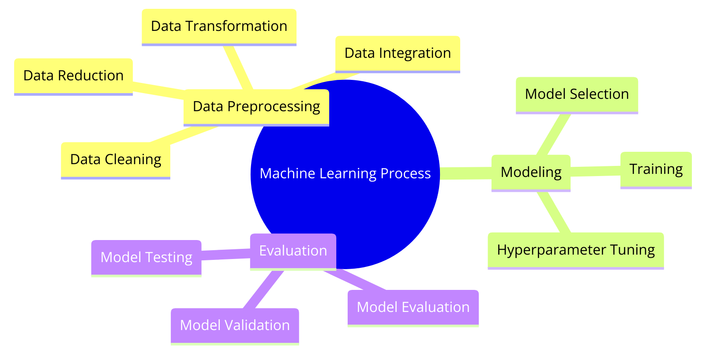

# Understanding the Machine Learning Process: A Comprehensive Guide

Machine learning (ML) has become a cornerstone of modern technology, driving advancements in various fields such as healthcare, finance, and transportation. To build effective ML models, it's essential to understand the three main steps in the machine learning process: Data Preprocessing, Modeling, and Evaluation. This article breaks down these steps, detailing the sub-steps involved and providing references for further reading and understanding.

## 1. Data Preprocessing

Data preprocessing is the first and arguably the most crucial step in the machine learning pipeline. This step ensures that the data is clean, consistent, and suitable for the modeling process.

### Sub-steps:

1. **Data Collection**: Gathering relevant data from various sources. This can include databases, APIs, and web scraping.
2. **Data Cleaning**: Removing or correcting any inaccuracies in the data, such as missing values, outliers, and duplicates.
3. **Data Transformation**: Converting data into a suitable format for analysis, which might involve normalization, standardization, or encoding categorical variables.
4. **Data Splitting**: Dividing the data into training, validation, and test sets to evaluate the model's performance.

### References:

- [Scikit-Learn Documentation on Data Preprocessing](https://scikit-learn.org/stable/modules/preprocessing.html)
- [Kaggle Data Preprocessing Tutorial](https://www.kaggle.com/learn/data-cleaning)

## 2. Modeling

Once the data is preprocessed, the next step is to build and train the machine learning model. This involves selecting the appropriate algorithm and fine-tuning it to achieve the best performance.

### Sub-steps:

1. **Algorithm Selection**: Choosing a machine learning algorithm based on the problem type (e.g., regression, classification, clustering).
2. **Model Training**: Feeding the training data into the algorithm to learn the underlying patterns and relationships.
3. **Hyperparameter Tuning**: Adjusting the algorithm's parameters to optimize performance. This can be done using techniques like grid search or random search.

### References:

- [Scikit-Learn Documentation on Supervised Learning](https://scikit-learn.org/stable/supervised_learning.html)
- [TensorFlow Model Training Guide](https://www.tensorflow.org/guide/keras/train_and_evaluate)

## 3. Evaluation

Evaluation is the final step in the machine learning process, where the model's performance is assessed to ensure it meets the desired criteria. This involves using various metrics to measure the accuracy, precision, recall, and other relevant aspects of the model.

### Sub-steps:

1. **Model Validation**: Using the validation set to tune the model and prevent overfitting.
2. **Performance Metrics**: Calculating metrics such as accuracy, precision, recall, F1 score, and AUC-ROC to evaluate the model's effectiveness.
3. **Cross-Validation**: Implementing techniques like k-fold cross-validation to ensure the model's robustness and reliability.

### References:

- [Scikit-Learn Documentation on Model Evaluation](https://scikit-learn.org/stable/modules/model_evaluation.html)
- [YouTube Video on Model Evaluation Metrics](https://www.youtube.com/watch?v=85dtiMz9tSo)

Understanding the machine learning process is fundamental to developing effective models that can make accurate predictions and provide valuable insights.
