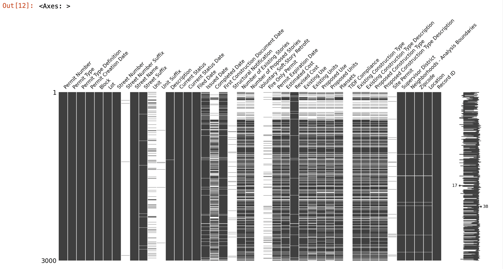
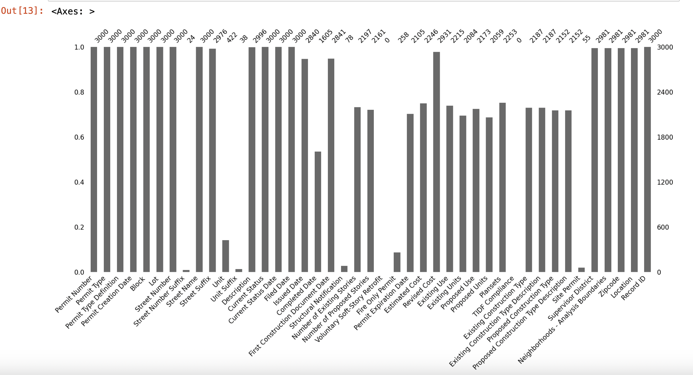
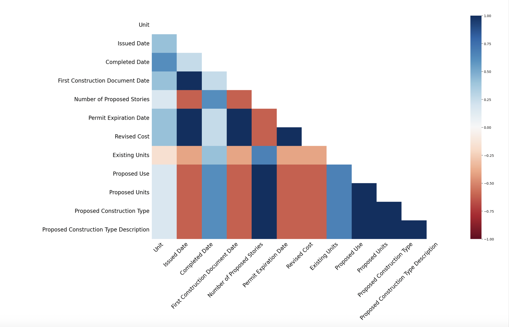
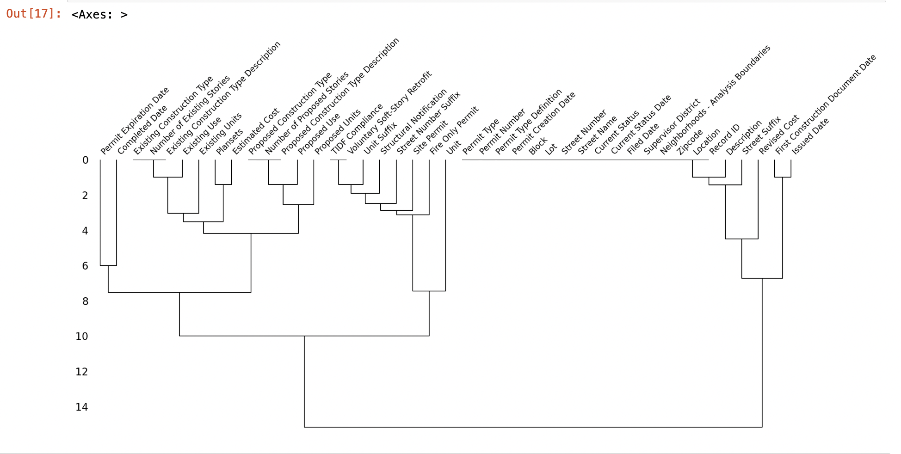

## Visualizing Missing Data: A Step-by-Step Guide

Handling missing data is crucial in data analysis and machine learning. Visualizing missing data helps to understand the extent and pattern of missingness, which can inform the choice of strategies for dealing with it. In this guide, we'll use Python and the `missingno` library to visualize missing data in a dataset.


You can download the Jupiter notebook of the example [Visualizing Missing Data](https://github.com/centrodph/ml/blob/main/data-processing/Visualization%20missing%20data%20techniques.ipynb)

<!-- truncate -->

## 1. Importing Libraries

First, we need to import the necessary libraries for data manipulation and visualization.

```python
import pandas as pd
import numpy as np
import missingno as msno
```

- **Pandas**: A powerful data manipulation library.
- **NumPy**: A fundamental package for numerical computations.
- **Missingno**: A library for visualizing missing data.

### 2. Loading the Data

We load the dataset into a Pandas DataFrame. For this example, we'll use a dataset that comes with the `missingno` library.
Same data that we used in the previous article [Machine Learning Handling Missing Values](./2024-06-01-machine-learning-handling-missing-values.md). You can download the dataset from the [Kaggle website](https://www.kaggle.com/code/alexisbcook/handling-missing-values/data?select=NFL+Play+by+Play+2009-2017+%28v4%29.csv)

```python
sf_permits = pd.read_csv("./Building_Permits.csv")

sf_permits.head()
```

    /tmp/ipykernel_50336/2707110962.py:1: DtypeWarning: Columns (22,32) have mixed types. Specify dtype option on import or set low_memory=False.
      sf_permits = pd.read_csv("./Building_Permits.csv")

Output:

<div>
<table >
  <thead>
    <tr>
      <th></th>
      <th>Permit Number</th>
      <th>Permit Type</th>
      <th>Permit Type Definition</th>
      <th>Permit Creation Date</th>
      <th>Block</th>
      <th>Lot</th>
      <th>Street Number</th>
      <th>Street Number Suffix</th>
      <th>Street Name</th>
      <th>Street Suffix</th>
      <th>...</th>
      <th>Existing Construction Type</th>
      <th>Existing Construction Type Description</th>
      <th>Proposed Construction Type</th>
      <th>Proposed Construction Type Description</th>
      <th>Site Permit</th>
      <th>Supervisor District</th>
      <th>Neighborhoods - Analysis Boundaries</th>
      <th>Zipcode</th>
      <th>Location</th>
      <th>Record ID</th>
    </tr>
  </thead>
  <tbody>
    <tr>
      <th>0</th>
      <td>201505065519</td>
      <td>4</td>
      <td>sign - erect</td>
      <td>05/06/2015</td>
      <td>0326</td>
      <td>023</td>
      <td>140</td>
      <td>NaN</td>
      <td>Ellis</td>
      <td>St</td>
      <td>...</td>
      <td>3.0</td>
      <td>constr type 3</td>
      <td>NaN</td>
      <td>NaN</td>
      <td>NaN</td>
      <td>3.0</td>
      <td>Tenderloin</td>
      <td>94102.0</td>
      <td>(37.785719256680785, -122.40852313194863)</td>
      <td>1380611233945</td>
    </tr>
    <tr>
      <th>1</th>
      <td>201604195146</td>
      <td>4</td>
      <td>sign - erect</td>
      <td>04/19/2016</td>
      <td>0306</td>
      <td>007</td>
      <td>440</td>
      <td>NaN</td>
      <td>Geary</td>
      <td>St</td>
      <td>...</td>
      <td>3.0</td>
      <td>constr type 3</td>
      <td>NaN</td>
      <td>NaN</td>
      <td>NaN</td>
      <td>3.0</td>
      <td>Tenderloin</td>
      <td>94102.0</td>
      <td>(37.78733980600732, -122.41063199757738)</td>
      <td>1420164406718</td>
    </tr>
    <tr>
      <th>2</th>
      <td>201605278609</td>
      <td>3</td>
      <td>additions alterations or repairs</td>
      <td>05/27/2016</td>
      <td>0595</td>
      <td>203</td>
      <td>1647</td>
      <td>NaN</td>
      <td>Pacific</td>
      <td>Av</td>
      <td>...</td>
      <td>1.0</td>
      <td>constr type 1</td>
      <td>1.0</td>
      <td>constr type 1</td>
      <td>NaN</td>
      <td>3.0</td>
      <td>Russian Hill</td>
      <td>94109.0</td>
      <td>(37.7946573324287, -122.42232562979227)</td>
      <td>1424856504716</td>
    </tr>
    <tr>
      <th>3</th>
      <td>201611072166</td>
      <td>8</td>
      <td>otc alterations permit</td>
      <td>11/07/2016</td>
      <td>0156</td>
      <td>011</td>
      <td>1230</td>
      <td>NaN</td>
      <td>Pacific</td>
      <td>Av</td>
      <td>...</td>
      <td>5.0</td>
      <td>wood frame (5)</td>
      <td>5.0</td>
      <td>wood frame (5)</td>
      <td>NaN</td>
      <td>3.0</td>
      <td>Nob Hill</td>
      <td>94109.0</td>
      <td>(37.79595867909168, -122.41557405519474)</td>
      <td>1443574295566</td>
    </tr>
    <tr>
      <th>4</th>
      <td>201611283529</td>
      <td>6</td>
      <td>demolitions</td>
      <td>11/28/2016</td>
      <td>0342</td>
      <td>001</td>
      <td>950</td>
      <td>NaN</td>
      <td>Market</td>
      <td>St</td>
      <td>...</td>
      <td>3.0</td>
      <td>constr type 3</td>
      <td>NaN</td>
      <td>NaN</td>
      <td>NaN</td>
      <td>6.0</td>
      <td>Tenderloin</td>
      <td>94102.0</td>
      <td>(37.78315261897309, -122.40950883997789)</td>
      <td>144548169992</td>
    </tr>
  </tbody>
</table>
<p>5 rows × 43 columns</p>
</div>

### 3. Matrix Plot

The matrix plot visualizes missing data by representing data points with vertical bars. Each bar shows the presence (white) or absence (black) of data points.

```python
msno.matrix(sf_permits)
```

Output:


**Why is it important?**
The matrix plot helps identify patterns in the missing data, such as whether missingness occurs at random or follows a specific pattern.

### 4. Bar Plot

The bar plot shows the number of non-missing (present) data points for each column.

```python
msno.bar(df)
```

Output:


**Why is it important?**
The bar plot provides a quick overview of the completeness of each column, highlighting columns with a high proportion of missing data.

### 5. Heatmap

The heatmap shows the correlation of missingness between different columns. A high correlation indicates that the presence of missing data in one column is related to the presence of missing data in another column.

```python
msno.heatmap(df)
```

Output:


**Why is it important?**
The heatmap helps identify relationships in missingness between columns, which can inform decisions on how to handle missing data, such as imputing missing values based on related columns.

### 6. Dendrogram

The dendrogram clusters columns based on the similarity of their missing data patterns.

```python
msno.dendrogram(df)
```

Output:


**Why is it important?**
The dendrogram helps identify groups of columns with similar missing data patterns, which can be useful for imputation or for understanding the underlying structure of the data.

**Conclusion**

Visualizing missing data is a crucial step in data preprocessing. It helps understand the extent and pattern of missingness, guiding the choice of strategies for handling missing data. By using tools like `missingno`, you can quickly and effectively visualize and analyze missing data in your datasets.

References:

- [Missingno Documentation](https://github.com/ResidentMario/missingno)
- [Pandas Documentation](https://pandas.pydata.org/pandas-docs/stable/)
- [NumPy Documentation](https://numpy.org/doc/stable/)
- [Mediuam article](https://medium.com/@mahnoorsalman96/checking-for-missing-values-for-machine-learning-bb4c263a6555)
